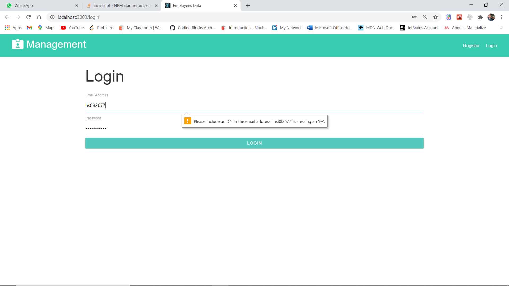

# Mindbowser-:mortar_board:

Entity:- Manager Properties: email,firstname,lastname,password,address,dob,company etc. 
Entity:- Employee Properties: empId,firstname,lastname,address,dob,mobile,city etc. 
 
Front End: ReactJS 
Instructions: 
1.Must use basic concepts of ReactJS 
2.Must use routing, redux, http server call. 
3.Please write a clear & clean code with proper comments. 
4.Your code will be reviewed on code style, best practices, exception handling, and code management. 
5.Feel free to use ui frameworks like bootstrap, material etc. 

Contains three screens: 
1.Manager sign up 
2.Manager login 
3.Home Screen 

Manager sign up : 
Manager should be able to signup using his properties. 

Manager login : 
Manager should be able to login using his email and password and should redirect to the homescreen. 
Should handle error scenarios. 

Home Screen : 
* Home screen should contain a list of employees and add employee button on top right corner. 
* On clicking add employee button popup should open where a manager can fill employee details and to submit details should send to the server and should store in the DB and error scenarios
should be handled. 
* The manager can update and delete employees from the list. 
* Provide a button to update employee records. On clicking the update button pop up should be open with employee details in edit mode. 
* Confirmation model should show before the update and delete employees. 

Back End : 
Instructions: 
1. Use the Nodejs(Express JS) / Java(Spring Boot)/any other framework. 
2. Must use MySQL/MongoDB for DB operations. 

## `Made by: Himanshu Singh & Email:hs882677@gmail.com`

## `I Used` :smiley:  
1) ReactJs (FrontEnd) :heart: 
2) Materializecss/Css (Styling)  
3) Nodejs & Express (BackEnd)  
4) MongoDB (DB)  

## `Some ScreenShots` :camera:
### `Desktop View` :computer:

#### `Image 1: Register Page`

#### `Image 2: Login Page`

#### `Image 3: Loading Animation`

#### `Image 4: Home Page`

#### `Image 5: Add Employee Form PopUp`

#### `Image 6: Employee Added Notification`

#### `Image 7: Update Employee Details Form PopUp`

#### `Image 8: Details Updated Notification`

#### `Image 9: Employee Deleted & Displaying Notification`

#### `Image 10-11: Search Employee In Searchbar Using Any field of Employee`

### `Mobile View` :iphone:

#### `Image 12: Register Page (Responsive)`

#### `Image 13: Login Page (Responsive)`

#### `Image 14: Home Page (Responsive)`

#### `Image 15-16: Add Employee Form PopUp (Responsive)`

#### `Image 17: Employee Added Notification (Responsive)`

#### `Image 18: Update Employee Details Form (Responsive)`

#### `Image 19: Details Updated Notification (Responsive)`

#### `Image 20: Search Employee In Searchbar Using Any Field of Employee Ex-Name (Responsive)`

#### `Image 21: Search Employee In Searchbar Using Any Field of Employee Ex-EmpId (Responsive)`

#### `Image 22: Search Employee In Searchbar Using Any Field of Employee Ex-Location (Responsive)`

#### `Image 23-24: Employee Deleted and Displaying Notification (Responsive)`

### `Thanks You` :raised_hands:
